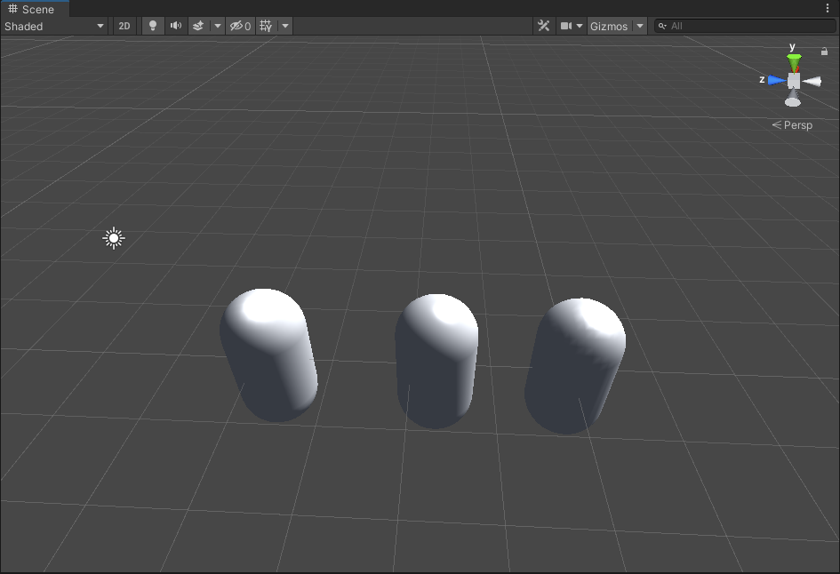

# Unity Shaders Book

## Chapter5

### 常见语义

* POSITION

  * 告知Unity：模型的顶点填充到v中
* SV_POSITION

  * 告知Unity：frag函数的输出是裁剪空间中的顶点坐标
  * SV ：(system value)
* SV_TARGET

  * 告诉渲染器：把用户的输出颜色储存到一个渲染目标（Render Target）中（输出到默认的帧缓存中）

### ShaderLab常见变量

### 常用拓展包

下载链接 http://unity3d.com/cn/get-unity/download/archive

安装路径 unity_location/Data/CGIncludes

**常用帮助函数**

| Function Name                               | Description                                                                                                         |
| ------------------------------------------- | ------------------------------------------------------------------------------------------------------------------- |
| float3 WorldSpaceViewDir(float4 v)          | 输入一个模型空间中的顶点位置，返回世界空间中从该顶点到摄像机的观察空间方向。 内部使用了UnityWorldSpaceViewDir函数   |
| float3 UnityWorldSpaceViewDir(float4 v)     | 输入一个世界空间中的顶点位置，返回世界空间中从该点到摄像机的观察方向                                                |
| float3 ObjSpaceViewDir(float4 v)            | 输入一个模型空间中的顶点位置，返回模型空间中从改点到摄像机的观察方向                                                |
| float3 WorldSpaceLightDir(float4 v)         | 输入一个模型空间中的顶点位置，返回世界空间中从该点到光源的光照方向。内部使用了UnityWorldSpaceLightDir，没有被归一化 |
| float3 UnityWorldSpaceLightDir(float4 v)    | 输入一个世界空间中的顶点位置，返回世界空间中从该点到光源的光照方向。没有被归一化                                    |
| float3 ObjSpaceLightDir(float4 v)           | 输入一个模型空间中的顶点位置，返回模型空间从该点到光源的光照方向。没有被归一化                                      |
| float3 UnityObjectToWorldDir(float3 dir)    | 把方向矢量从模型空间变化到世界空间中                                                                                |
| float3 UnityObjectToWorldNormal(float3 dir) | 把法线方向从模型空间转换到世界空间中                                                                                |
| float3 UnityWorldToObjectDir(float3 dir)    | 把方向矢量从世界空间变化到模型空间                                                                                  |

## Chapter 6 光照

### 经典模型

#### 高光部分

##### Phong模型

##### Blinn-Phong模型

， 其中：

#### 基本光照模型

漫反射部分：

#### 效果

*左到右分别为**Blinn_Phong**，逐**顶点**基本光照模型，逐**片元**基本光照模型*

### 名词解释

#### 前向渲染

## NOTES

布林-冯模型的实现和基本光照模型差距不大，仅仅省去了计算反射方向的步骤，直接使用“半向量”点乘视线方向；但是高光效果更好

1. 逐顶点与逐片元的优劣
